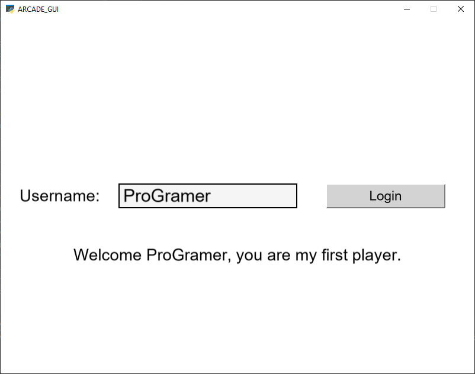

# GUI Library for Python Arcade

This project targets to offer simple to complex ui elements
to use in games and software written with the Python Arcade library.

Some UI components were copied over to adjust and fix them.

This project could also end up in a PR to integrate within Arcade.

## Basic Components

#### UIView
Central class to manager the ui components.
Converts `on_` callback functions into events, so that UIElements
just have to contain one method to interact with user input.

#### UIElement
A general interface of an UI element.

## Examples

Examples providing an overview of features, there will be dedicated documentation soon.

* [UILabel](https://github.com/eruvanos/arcade_gui/blob/master/examples/show_uilabel.py)
* [UIButton](https://github.com/eruvanos/arcade_gui/blob/master/examples/show_uibutton.py)
* [UIInputBox](https://github.com/eruvanos/arcade_gui/blob/master/examples/show_uiinputbox.py)
* [Example with ID](https://github.com/eruvanos/arcade_gui/blob/master/examples/show_id_example.py)

### Screenshots

## Features for first release

* [x] UILabel
    * [x] Align with UITextInput
* [x] UIButton
* [x] Focused element tracked
* [x] ID reference system for UIElements
* [x] CI/CD
* [x] UITextInput
    * [x] Basic setup
    * [ ] Scroll text with cursor
    * [ ] Set max length
    * [ ] Emit event on ENTER
* [ ] UIElements emit own UIEvents
    * [x] UIButton
    * [ ] UITextInput
* [ ] UIImageButton
* [ ] UITexturedInputBox
* [ ] FlatButtons (https://codepen.io/maziarzamani/full/YXgvjv)
* [ ] UITextArea
* [ ] Theme support
    * [ ] Provide different standard themes for flat buttons
* [ ] Add documentation and doc strings (sphinx)
    * [ ] release notes
    * [ ] setup readthedocs
* [ ] track new features and issues in Github

### Chores

* [ ] harmonize constructors `x, y` vs `center_x, center_y`
* [ ] figure out, how `UIView.find_by_id` does not produce typing warnings
* [ ] improve docs
    * [x] fix reference to examples
    * [x] include screenshots (at least one)
* [ ] make 3D Button more realistic, or change to flat buttons
* [ ] support Python 3.7

## Background information and other frameworks

### Reference Pygame GUI projects

[Overview](https://www.pygame.org/wiki/gui)

* ThorPy
    * http://www.thorpy.org/index.html
* Phil's pyGame Utilities
    * https://www.pygame.org/project/108
* OcempGUI
    * https://www.pygame.org/project/125
* PyGVisuals
    * https://github.com/Impelon/PyGVisuals
* Pygame GUI
    * [Homepage](https://github.com/MyreMylar/pygame_gui)
    * [Examples](https://github.com/MyreMylar/pygame_gui_examples)
    * [QuickStart Example](https://github.com/MyreMylar/pygame_gui_examples/blob/master/quick_start.py)
    * Concept
        * UIManager manages every interaction, new elements get the UIManager on creation
        * Elements create events and hook into pygames event system
        * Themes can be read from JSON files

### Ideas
* Create own implementation
* Build adapter for PyGame GUI